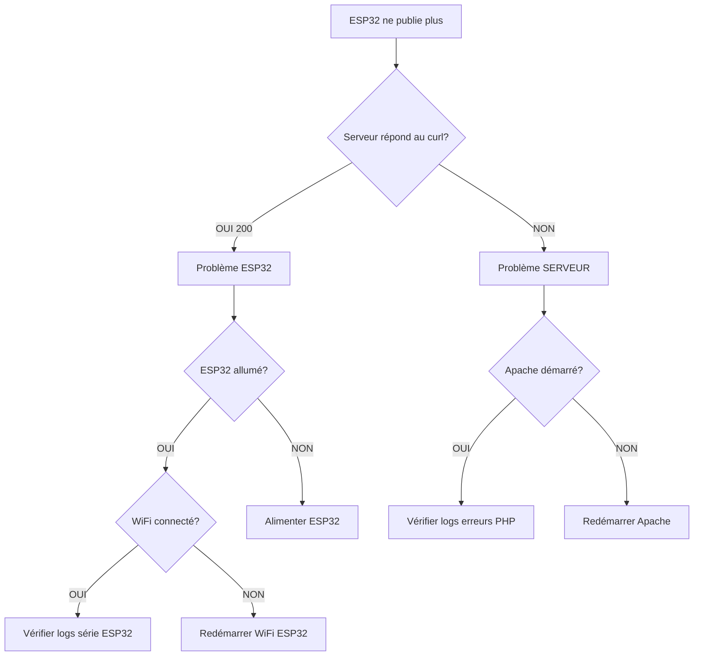

# 🔍 Diagnostic ESP32 - Guide de Dépannage Complet

**Problème**: L'ESP32 n'arrive plus à publier les données sur la BDD depuis plus d'une heure  
**Date**: 11 octobre 2025  
**Projet**: FFP3 Aquaponie IoT

---

## 📋 Table des Matières

1. [Diagnostic Rapide (2 minutes)](#diagnostic-rapide)
2. [Vérifications Serveur](#vérifications-serveur)
3. [Vérifications ESP32](#vérifications-esp32)
4. [Tests Manuels](#tests-manuels)
5. [Solutions par Scénario](#solutions-par-scénario)

---

## 🚀 Diagnostic Rapide (2 minutes)

### Étape 1: Vérifier les dernières données reçues

Connectez-vous à la base de données et exécutez:

```sql
-- Voir la dernière donnée reçue
SELECT 
    reading_time, 
    sensor,
    version,
    TempAir,
    TempEau,
    TIMESTAMPDIFF(MINUTE, reading_time, NOW()) as minutes_ago
FROM ffp3Data 
ORDER BY reading_time DESC 
LIMIT 1;
```

**Résultat attendu**: `minutes_ago` devrait être < 5 minutes

❌ Si `minutes_ago` > 60 minutes → **L'ESP32 ne publie plus**

---

### Étape 2: Vérifier que le serveur répond

Testez l'endpoint POST avec curl:

```bash
curl -X POST "https://iot.olution.info/ffp3/public/post-data" \
  -H "Content-Type: application/x-www-form-urlencoded" \
  -d "api_key=fdGTMoptd5CD2ert3&sensor=TEST&version=DIAG&TempAir=22.5"
```

**Résultats possibles**:

| Réponse | Signification | Action |
|---------|---------------|--------|
| `200 Données enregistrées avec succès` | ✅ Serveur OK | Problème ESP32 |
| `401 Clé API incorrecte` | ❌ API Key invalide | Vérifier .env |
| `405 Méthode non autorisée` | ❌ Problème routing | Vérifier Slim |
| `500 Erreur serveur` | ❌ Erreur PHP/BDD | Voir logs |
| Timeout / Pas de réponse | ❌ Serveur down | Vérifier Apache |

---

### Étape 3: Identifier le problème



---

## 🖥️ Vérifications Serveur

### 1. Vérifier que les fichiers existent

```bash
cd /home4/oliviera/iot.olution.info/ffp3/ffp3datas

# Vérifier les fichiers critiques
ls -lh public/post-data.php
ls -lh public/index.php
ls -lh src/Controller/PostDataController.php
```

**Attendu**: Tous les fichiers doivent exister

---

### 2. Vérifier les logs serveur

```bash
# Logs des erreurs PHP
tail -f /home4/oliviera/iot.olution.info/ffp3/ffp3datas/error_log

# Logs des erreurs public
tail -f /home4/oliviera/iot.olution.info/ffp3/ffp3datas/public/error_log

# Logs CRON
tail -f /home4/oliviera/iot.olution.info/ffp3/ffp3datas/cronlog.txt

# Logs POST data (si ils existent)
tail -f /home4/oliviera/iot.olution.info/ffp3/ffp3datas/var/logs/post-data.log
```

**Cherchez**:
- Erreurs 401 (API Key invalide)
- Erreurs 500 (Erreurs PHP/SQL)
- Erreurs de connexion BDD
- Erreurs de parsing JSON

---

### 3. Vérifier la configuration .env

```bash
cd /home4/oliviera/iot.olution.info/ffp3/ffp3datas
cat .env | grep -E "API_KEY|DB_|ENV="
```

**Vérifiez**:
```env
API_KEY=fdGTMoptd5CD2ert3
DB_HOST=localhost
DB_NAME=oliviera_iot
DB_USER=oliviera_iot
DB_PASS="Iot#Olution1"
ENV=prod
```

---

### 4. Vérifier la base de données

```sql
-- Connexion
mysql -u oliviera_iot -p

-- Vérifier que la table existe
USE oliviera_iot;
SHOW TABLES LIKE 'ffp3Data%';

-- Vérifier l'espace disponible
SELECT 
    table_name,
    ROUND(((data_length + index_length) / 1024 / 1024), 2) AS "Size (MB)"
FROM information_schema.TABLES 
WHERE table_schema = "oliviera_iot" 
    AND table_name LIKE 'ffp3Data%';

-- Vérifier les dernières insertions
SELECT 
    DATE(reading_time) as date, 
    COUNT(*) as count 
FROM ffp3Data 
GROUP BY DATE(reading_time) 
ORDER BY date DESC 
LIMIT 7;
```

---

### 5. Tester l'insertion manuelle

```sql
-- Insérer une donnée de test
INSERT INTO ffp3Data (
    sensor, version, TempAir, Humidite, TempEau, 
    EauAquarium, EauReserve, reading_time
) VALUES (
    'TEST-MANUAL', 'DIAG-1.0', 22.5, 65.0, 24.0,
    32.0, 78.0, NOW()
);

-- Vérifier l'insertion
SELECT * FROM ffp3Data WHERE sensor = 'TEST-MANUAL' ORDER BY id DESC LIMIT 1;

-- Nettoyer
DELETE FROM ffp3Data WHERE sensor = 'TEST-MANUAL';
```

**Si l'insertion échoue**: Problème de BDD (permissions, espace disque, contraintes)

---

### 6. Exécuter le script de diagnostic automatique

```bash
cd /home4/oliviera/iot.olution.info/ffp3/ffp3datas
php tools/diagnostic_esp32.php
```

Ce script vérifiera automatiquement:
- ✅ Configuration .env
- ✅ Connexion BDD
- ✅ Dernières données reçues
- ✅ Endpoints disponibles
- ✅ Logs récents
- ✅ Espace disque
- ✅ Test d'insertion

---

## 🔌 Vérifications ESP32

### 1. Vérifier l'alimentation et le WiFi

**Indicateurs visuels sur l'ESP32**:
- LED bleue clignotante → WiFi connecté ✅
- LED bleue fixe → WiFi en connexion ⏳
- Pas de LED → Pas alimenté ❌

**Via logs série (USB)**:

```bash
# Avec Arduino IDE ou PlatformIO
# Ouvrir le moniteur série (115200 baud)

# Vous devriez voir:
[WiFi] Connected to SSID
[WiFi] IP: 192.168.x.x
[HTTP] POST to https://iot.olution.info/ffp3/public/post-data
[HTTP] Response: 200 OK
[HTTP] Body: Données enregistrées avec succès
```

---

### 2. Vérifier la configuration réseau

**Commandes ESP32** (si interface série disponible):

```cpp
// Dans le code ESP32, ajouter ces logs:
Serial.println("WiFi SSID: " + WiFi.SSID());
Serial.println("WiFi IP: " + WiFi.localIP().toString());
Serial.println("WiFi Signal: " + String(WiFi.RSSI()) + " dBm");
Serial.println("Server URL: " + String(serverUrl));
Serial.println("API Key: " + String(apiKey).substring(0, 5) + "***");
```

---

### 3. Vérifier l'URL et l'API Key dans le code ESP32

**Fichier à vérifier**: Votre code ESP32 (`.ino` ou `.cpp`)

```cpp
// VÉRIFIER CES CONSTANTES:
const char* serverUrl = "https://iot.olution.info/ffp3/public/post-data";
const char* apiKey = "fdGTMoptd5CD2ert3";

// PAS:
// ❌ "http://iot.olution.info/..."  (sans HTTPS)
// ❌ ".../ffp3datas/public/post-data"  (ancien chemin)
// ❌ ".../post-ffp3-data.php"  (legacy)
```

---

### 4. Vérifier le timeout HTTP

```cpp
// Le timeout doit être suffisant (au moins 10 secondes)
http.setTimeout(10000);  // 10 secondes

// PAS:
// ❌ http.setTimeout(1000);  // Trop court!
```

---

### 5. Tester la requête HTTP manuellement

**Depuis un ordinateur sur le même réseau que l'ESP32**:

```bash
# Test avec curl (simule l'ESP32)
curl -v -X POST "https://iot.olution.info/ffp3/public/post-data" \
  -H "Content-Type: application/x-www-form-urlencoded" \
  -d "api_key=fdGTMoptd5CD2ert3" \
  -d "sensor=ESP32-Main" \
  -d "version=10.90" \
  -d "TempAir=22.5" \
  -d "Humidite=65.0" \
  -d "TempEau=24.0" \
  -d "EauAquarium=32.0" \
  -d "EauReserve=78.0"
```

**Résultat attendu**:
```
< HTTP/2 200
< content-type: text/plain; charset=utf-8
<
Données enregistrées avec succès
```

---

## 🧪 Tests Manuels

### Test 1: Serveur accessible depuis Internet

```bash
curl -I https://iot.olution.info/ffp3/
```

**Attendu**: `HTTP/2 200` ou `HTTP/2 301`

---

### Test 2: Endpoint POST répond

```bash
curl -X POST https://iot.olution.info/ffp3/public/post-data \
  -d "api_key=fdGTMoptd5CD2ert3&sensor=CURL-TEST&TempAir=20"
```

**Attendu**: `Données enregistrées avec succès`

---

### Test 3: API Key invalide

```bash
curl -X POST https://iot.olution.info/ffp3/public/post-data \
  -d "api_key=WRONG_KEY&sensor=TEST&TempAir=20"
```

**Attendu**: `401 Clé API incorrecte`

---

### Test 4: Méthode GET (non autorisée)

```bash
curl https://iot.olution.info/ffp3/public/post-data?api_key=fdGTMoptd5CD2ert3
```

**Attendu**: `405 Méthode non autorisée`

---

### Test 5: Vérifier dans la BDD

```sql
-- Après un test curl réussi:
SELECT * FROM ffp3Data 
WHERE sensor = 'CURL-TEST' 
ORDER BY reading_time DESC 
LIMIT 1;

-- Nettoyer
DELETE FROM ffp3Data WHERE sensor = 'CURL-TEST';
```

---

## 🔧 Solutions par Scénario

### Scénario 1: Serveur OK, ESP32 ne publie pas

**Symptômes**:
- ✅ Curl fonctionne (200 OK)
- ❌ Pas de données récentes dans la BDD

**Causes possibles**:
1. ESP32 éteint / pas alimenté
2. ESP32 déconnecté du WiFi
3. URL incorrecte dans le code ESP32
4. API Key incorrecte dans le code ESP32
5. Problème réseau (firewall, DNS)

**Solutions**:

```bash
# 1. Vérifier l'alimentation
#    → Brancher l'ESP32 sur USB ou alimentation externe

# 2. Vérifier le WiFi
#    → Ouvrir le moniteur série (115200 baud)
#    → Chercher "WiFi connected" ou "IP:"

# 3. Re-flasher le firmware ESP32
#    → Via PlatformIO ou Arduino IDE
#    → Vérifier URL et API Key avant de flasher

# 4. Augmenter les logs debug
#    → Ajouter Serial.println() partout dans le code
#    → Observer la sortie série pendant l'exécution

# 5. Tester avec un firmware minimal
```

**Code ESP32 minimal de test**:

```cpp
#include <WiFi.h>
#include <HTTPClient.h>

const char* ssid = "VOTRE_SSID";
const char* password = "VOTRE_PASSWORD";
const char* serverUrl = "https://iot.olution.info/ffp3/public/post-data";
const char* apiKey = "fdGTMoptd5CD2ert3";

void setup() {
    Serial.begin(115200);
    WiFi.begin(ssid, password);
    
    while (WiFi.status() != WL_CONNECTED) {
        delay(500);
        Serial.print(".");
    }
    Serial.println("\nWiFi connected!");
}

void loop() {
    HTTPClient http;
    http.begin(serverUrl);
    http.addHeader("Content-Type", "application/x-www-form-urlencoded");
    http.setTimeout(10000);
    
    String postData = "api_key=" + String(apiKey);
    postData += "&sensor=ESP32-TEST";
    postData += "&version=1.0";
    postData += "&TempAir=22.5";
    
    Serial.println("[HTTP] POST: " + serverUrl);
    int httpCode = http.POST(postData);
    
    Serial.println("[HTTP] Response code: " + String(httpCode));
    Serial.println("[HTTP] Response body: " + http.getString());
    
    http.end();
    
    delay(180000); // 3 minutes
}
```

---

### Scénario 2: Serveur répond 401 (API Key incorrecte)

**Symptômes**:
- ❌ Curl retourne `401 Clé API incorrecte`

**Causes**:
1. API_KEY dans `.env` différente de celle dans l'ESP32
2. Espaces ou caractères invisibles dans l'API Key
3. Fichier `.env` non chargé

**Solutions**:

```bash
# 1. Vérifier l'API Key dans .env
cat /home4/oliviera/iot.olution.info/ffp3/ffp3datas/.env | grep API_KEY

# Attendu: API_KEY=fdGTMoptd5CD2ert3

# 2. Tester avec la clé extraite
API_KEY=$(grep "^API_KEY=" .env | cut -d'=' -f2)
curl -X POST https://iot.olution.info/ffp3/public/post-data \
  -d "api_key=${API_KEY}&sensor=TEST&TempAir=20"

# 3. Si toujours 401, régénérer une nouvelle clé
#    et mettre à jour .env ET le code ESP32
```

---

### Scénario 3: Serveur répond 500 (Erreur serveur)

**Symptômes**:
- ❌ Curl retourne `500 Erreur serveur`

**Causes**:
1. Erreur SQL (table manquante, colonne manquante)
2. Erreur PHP (fatal error, exception)
3. Connexion BDD échouée
4. Espace disque plein

**Solutions**:

```bash
# 1. Voir les logs d'erreurs
tail -n 50 /home4/oliviera/iot.olution.info/ffp3/ffp3datas/error_log

# 2. Vérifier l'espace disque
df -h /home4/oliviera/iot.olution.info/

# 3. Vérifier que MySQL est démarré
systemctl status mysql
# ou
service mysql status

# 4. Tester la connexion BDD
mysql -u oliviera_iot -p -e "SELECT 1"

# 5. Vérifier les permissions des fichiers
ls -la /home4/oliviera/iot.olution.info/ffp3/ffp3datas/public/

# 6. Réinitialiser les permissions si nécessaire
chmod 755 /home4/oliviera/iot.olution.info/ffp3/ffp3datas/public/
chmod 644 /home4/oliviera/iot.olution.info/ffp3/ffp3datas/public/*.php
```

---

### Scénario 4: Timeout / Serveur ne répond pas

**Symptômes**:
- ❌ Curl timeout après 30 secondes
- ❌ Pas de réponse du serveur

**Causes**:
1. Apache/Nginx arrêté
2. Problème réseau (firewall, DNS)
3. SSL/TLS expiré
4. Serveur surchargé

**Solutions**:

```bash
# 1. Vérifier qu'Apache est démarré
systemctl status httpd
# ou
systemctl status apache2

# Si arrêté:
systemctl start httpd

# 2. Vérifier les ports ouverts
netstat -tlnp | grep -E '80|443'

# 3. Tester en local (sur le serveur)
curl -I http://localhost/ffp3/

# 4. Vérifier les logs Apache
tail -f /var/log/httpd/error_log
# ou
tail -f /var/log/apache2/error.log

# 5. Vérifier le certificat SSL
openssl s_client -connect iot.olution.info:443 -servername iot.olution.info
```

---

### Scénario 5: Données anciennes mais serveur OK maintenant

**Symptômes**:
- ✅ Serveur répond maintenant
- ❌ Dernières données datent d'il y a plusieurs heures
- ✅ ESP32 fonctionne maintenant

**Cause probable**: Problème temporaire résolu

**Actions**:

```sql
-- Vérifier l'historique des insertions
SELECT 
    DATE_FORMAT(reading_time, '%Y-%m-%d %H:00:00') as hour,
    COUNT(*) as readings
FROM ffp3Data 
WHERE reading_time >= DATE_SUB(NOW(), INTERVAL 24 HOUR)
GROUP BY DATE_FORMAT(reading_time, '%Y-%m-%d %H:00:00')
ORDER BY hour DESC;

-- Chercher les trous dans les données
-- Attendu: ~20-30 readings par heure (toutes les 2-3 min)
```

**Si vous trouvez un trou**:
- 🕐 Corréler avec les logs serveur à cette heure-là
- 🕐 Vérifier s'il y avait une maintenance
- 🕐 Vérifier les logs ESP32 (si sauvegardés)

---

## 📊 Checklist de Vérification Complète

### Serveur

- [ ] Apache/Nginx démarré
- [ ] MySQL démarré
- [ ] Fichier `.env` présent et correct
- [ ] `API_KEY` définie dans `.env`
- [ ] Table `ffp3Data` existe
- [ ] Espace disque disponible (> 10%)
- [ ] Permissions fichiers OK (644/755)
- [ ] Logs ne montrent pas d'erreurs récentes
- [ ] Test curl retourne 200 OK
- [ ] Insertion manuelle BDD fonctionne

### ESP32

- [ ] ESP32 alimenté
- [ ] LED WiFi active
- [ ] Connexion WiFi établie
- [ ] URL correcte dans le code
- [ ] API Key correcte dans le code
- [ ] Timeout HTTP >= 10 secondes
- [ ] Logs série montrent les tentatives POST
- [ ] Pas d'erreurs dans les logs série

### Réseau

- [ ] Serveur accessible depuis Internet
- [ ] DNS résout `iot.olution.info`
- [ ] Port 443 (HTTPS) ouvert
- [ ] Certificat SSL valide
- [ ] Pas de firewall bloquant l'ESP32

---

## 🚨 Actions d'Urgence

Si l'ESP32 ne publie pas depuis longtemps et que c'est critique:

### Option 1: Redémarrage complet

```bash
# 1. Redémarrer l'ESP32
#    → Débrancher/rebrancher l'alimentation
#    → Attendre 10 secondes

# 2. Redémarrer Apache
systemctl restart httpd

# 3. Redémarrer MySQL (si nécessaire)
systemctl restart mysql

# 4. Vérifier que tout est OK
curl -X POST https://iot.olution.info/ffp3/public/post-data \
  -d "api_key=fdGTMoptd5CD2ert3&sensor=TEST&TempAir=20"
```

### Option 2: Basculer sur l'endpoint legacy

**Si le nouveau système ne fonctionne pas**, utiliser temporairement l'ancien:

```cpp
// Dans le code ESP32, changer:
const char* serverUrl = "https://iot.olution.info/ffp3/post-ffp3-data.php";
// au lieu de:
// const char* serverUrl = "https://iot.olution.info/ffp3/public/post-data";
```

### Option 3: Mode debug intensif

```cpp
// Ajouter dans le code ESP32:
#define DEBUG_HTTP 1

void sendData() {
    #ifdef DEBUG_HTTP
    Serial.println("=== HTTP POST START ===");
    Serial.println("URL: " + String(serverUrl));
    Serial.println("WiFi Status: " + String(WiFi.status()));
    Serial.println("WiFi RSSI: " + String(WiFi.RSSI()));
    Serial.println("Free Heap: " + String(ESP.getFreeHeap()));
    #endif
    
    HTTPClient http;
    http.begin(serverUrl);
    http.setTimeout(15000);
    
    // ... reste du code ...
    
    #ifdef DEBUG_HTTP
    Serial.println("HTTP Code: " + String(httpCode));
    Serial.println("Response: " + http.getString());
    Serial.println("=== HTTP POST END ===\n");
    #endif
}
```

---

## 📞 Support

Si le problème persiste après avoir suivi ce guide:

1. **Collecter les informations**:
   ```bash
   # Créer un rapport de diagnostic
   echo "=== DIAGNOSTIC REPORT ===" > /tmp/diagnostic_report.txt
   echo "Date: $(date)" >> /tmp/diagnostic_report.txt
   echo "" >> /tmp/diagnostic_report.txt
   
   echo "=== DERNIÈRES DONNÉES ===" >> /tmp/diagnostic_report.txt
   mysql -u oliviera_iot -p oliviera_iot -e \
     "SELECT * FROM ffp3Data ORDER BY reading_time DESC LIMIT 5" \
     >> /tmp/diagnostic_report.txt
   
   echo "" >> /tmp/diagnostic_report.txt
   echo "=== LOGS ERREURS ===" >> /tmp/diagnostic_report.txt
   tail -n 50 /home4/oliviera/iot.olution.info/ffp3/ffp3datas/error_log \
     >> /tmp/diagnostic_report.txt
   
   echo "" >> /tmp/diagnostic_report.txt
   echo "=== TEST CURL ===" >> /tmp/diagnostic_report.txt
   curl -v -X POST https://iot.olution.info/ffp3/public/post-data \
     -d "api_key=fdGTMoptd5CD2ert3&sensor=DIAG&TempAir=20" \
     >> /tmp/diagnostic_report.txt 2>&1
   
   cat /tmp/diagnostic_report.txt
   ```

2. **Partager le rapport** avec votre administrateur système ou développeur

---

## 📚 Références

- [ESP32_API_REFERENCE.md](./ESP32_API_REFERENCE.md) - Documentation API complète
- [README.md](./README.md) - Architecture du projet
- [QUICKSTART_V4.md](./QUICKSTART_V4.md) - Guide de démarrage

---

**Fin du Guide de Diagnostic**  
**Version**: 1.0  
**Dernière mise à jour**: 11 octobre 2025

